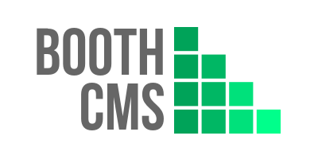

BoothCMS
========

BoothCMS is a simple flat file CMS.

Features
--------

* No database
* No administration function - create contents as files and copy to the web server
* Content format is a composite of [YAML](http://yaml.org/)(headers) and [Markdown](https://learn.getgrav.org/content/markdown)(body)
* Template can be specified for each content
* List display control function
* Built-in feed([Atom Syndication Format](https://tools.ietf.org/html/rfc4287)) and [Sitemaps](https://www.sitemaps.org/) generator
* Built-in tag support
* Server-side and client-side hybrid rendering
* Tag-based related contents extraction
